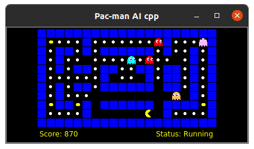

# pacman-ai-cpp
Pac-man AI Framework written in c++17.

This framework can be used to evaluate AI Planning algorithms. All you need to do is write your pac-man implementation and provide a layout file.

More importantly, this framework can be used to learn AI Planning algorithms by writing their implementation in C++.



## Related project
This project is inspired by [The Pac-Man Projects](http://ai.berkeley.edu/project_overview.html).

# How to build and run the application
## Dependencies
To build the project you need to install the following dependencies:
* Compiler that supports C++17
* CMake
* clang-tidy (for linter)
* Qt5 (for display)
* GTest (for building unit tests)
* spdlog (for logging)
* yaml-cpp (for configs)

## Use docker container
The easiest way for you is to use the docker container to build and run the pacman-ai-cpp application.
After installing docker on your system, you can run the following command to build the docker image:

    docker build --tag pacman-ai-cpp:latest --file Dockerfile . 

### Starting container
To build the software, start your container at the root of the project by executing ```./setup.sh```.
It supports both Linux and Mac OS.

#### Using Docker container on Mac OS
If you are using the docker container on Mac OS, you must install [xquartz](https://www.xquartz.org/) before executing ```./setup.sh```. It is required to run GUI applications on containers.

To run in a container shell, you can execute the following:

    ./main/pacman -l ./layout_files/medium_5_ghosts.lay -p random

If you modify config or layout files, you have to execute ```cmake ..``` to copy them to the build directory.


## Build
To build the application, from the root directory, execute:

     mkdir build && cd build
     cmake ..
     make

# Examples
This framework comes with Random Movement Pac-man see [random_pacman_impl.cpp](agent/random_pacman_impl.cpp). It simply checks the state of the world, get possible actions (not blocked by walls) and randomly chooses one.

To execute the example after building it, you can simply execute:

    ./main/pacman -l ./layout_files/medium_5_ghosts.lay -p random

random is your pac-man algorithm's name.

## Write your own Pac-man Implementation
You can follow the examples to write your own pac-man implementation.

# Documentation
If you're interested in understanding the details you can read the blog post [here]().

# Issues
Please report issues if you found bugs or raise a Pull Request.